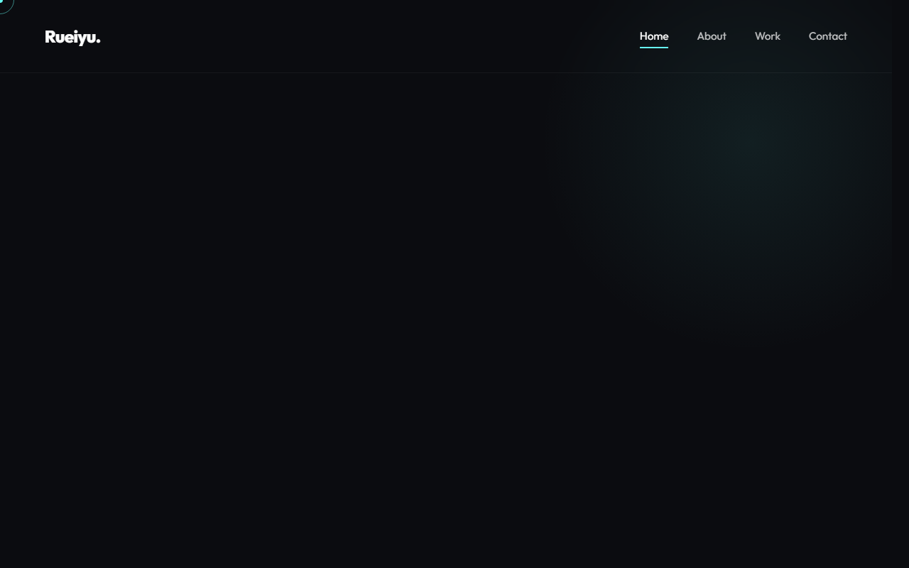

# Rueiyu - Personal Portfolio

A sleek, premium, and minimalist personal portfolio webpage built using core web technologies. Inspired by modern design templates, it offers a visually appealing and responsive user experience.

**[Live Demo](https://uricorn99.github.io/0225DICDRL/)**



## ✨ Features

- **Modern Glassmorphism Navbar**: Clean, sticky navigation with smooth hover effects.
- **Dynamic Real-Time Clock**: Built-in clock displaying the user's localized time, updating every second.
- **Custom Interactive Cursor**: A unique dotted cursor that follows the mouse and scales interactively when hovering over links and buttons.
- **Premium Aesthetics**: Features a deep dark mode theme, gradient texts, and smooth `fadeInUp` micro-animations.
- **Responsive Design**: Adapts beautifully to mobile, tablet, and desktop screens.

## 🛠️ Technology Stack

- **HTML5**: Semantic structure.
- **CSS3 (Vanilla)**: Features variables, animations, flexbox, and media queries for styling. Uses the modern [Outfit](https://fonts.google.com/specimen/Outfit) Google font.
- **JavaScript (Vanilla)**: Handles the custom cursor logic and the real-time clock functionality.

## 🚀 Getting Started

To view the portfolio locally:

1. Clone this repository to your local machine:
   ```bash
   git clone https://github.com/Uricorn99/0225DICDRL.git
   ```
2. Navigate to the project directory.
3. Open `index.html` in any modern web browser.

*Created by an AI coding assistant.*
